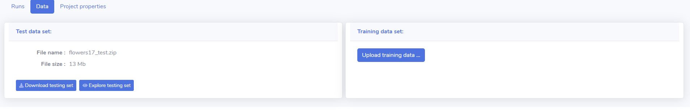

# LDM framework tutorial 


To demonstrate LDM framework in action we will walk through a very basic example of framework usage.

## LDM framework

Main features of the framework are :

- to create a new project (ordered set of runs)
- to add training data sets (training data set, test data set) to this project
  - to explore uploaded train/test data sets
- to create a run belonging to the project
- to record the progress of an ongoing run (create log entries and save run metadata)
- to save (upload) files used in the run

## Table of contents
=================

<!--ts-->
   * [LDM framework](#LDM-framework)
   * [Table of contents](#table-of-contents)
   * [Installation](#installation)
   * [Usage](#usage)
      * [Logging in](#logging-in)
      * [Creating a project](#project-creation)
      * [Exploring a project](#project-exploration)
      * [Creating a run](#run-creation)
      * [Exploring a run](#run-exploration)
      * [Data sets](#data-sets)
        * [Data set format](#data-set-format)
        * [Uploading data sets](#uploading-data-sets)
        * [Exploring data sets](#exploring-data-sets)

<!--te-->


## Installation
To start using the framework you need to have access to a running framework instance: you can either run your own local instance or use an instance hosted on some remote server. The easiest way to run local instance is to clone repo from https://github.com/IMCS-DL4media/LDM, cd to LDM directory  and run: 

```
docker-compose build 
docker-compose up
```

## Usage 
### Logging in
If execution of the above mentioned docker-compose commands is successful, you should be able to point your browser to http://localhost:8000  and see LDM framework login form (as in fig.below):


The default user/password is user1/psw1. To login you need to enter these values in the appropriate fields.
After that you will see LDM framework main form (list of projects) currently containing no projects (as in fig.below):


### Project creation

Natural next step is to create a new project (that can be done by clicking “Create new project … ” button).  Clicking on this button opens a New Project dialog:


In this dialog you can enter a name for your new project and short description of it (at the given point there is only one type of projects – image classification). After that you click create and if everything is ok you will see a message  “Project created successfully” and item corresponding to a newly created project will appear in the list of projects:
 


<!-- Now you need to press F5 to refresh a list of projects. After that, newly created project can be seen (see fig. below).
 
 -->

### Project exploration

After clicking on the name of the new project (t1) we are transfered from a list of projects to a page dedicated specifically to a project that we clicked on: 

<!--  -->
 
Project page consists of 3 parts:

- list of project runs – here we can explore runs created in this project


- data sets pane – here we can upload testing set / training set


- project properties pane – here we can see , not surprisingly, project properties


 
### Run creation

Currently, list of runs is empty – to see something there we need to create a run. Runs are created by running python programs, containing calls of LDM framework  [logging functions](./../../python_client_library/README.md).  An example of this kind of program is present in [python_logging_client.py](../../python_client_app/python_logging_client.py) . Let us take a look at this simple python program – it deliberately does not have any machine learning code, just calls of LDM logging functions.

Code from [python_logging_client.py](https://github.com/IMCS-DL4media/LDM/blob/bb68a1b3f75fb306914a8cd38e0351f4fe7e7c88/python_client_app/python_logging_client.py#L24):

```Python
from python_client_library.logging_functions import login, start_run, log, upload_file, finish_run


def main():
    print("Starting main ... ")
    logged_in = login('user1', 'psw1')
    if logged_in:
        print("Logged in successfully.")
    else:
        print("Login failed.")
        exit()

    start_run("t1")

    log("starting program execution", "test")
    
    log("test msg 1", "test")
    
    upload_file('./python_client_app/weights.txt',".chp")
    upload_file('./python_client_app/python_logging_client.py', "code")

    log("finishing program execution", "test")
    finish_run()


main()
```

We start by importing necessary LDM framework functions - `login, start_run, log, upload_file, finish_run` (line 1). After that we login to LDM framework instance by providing default user/psw (line 6). Actually, `login` function has an optional third parameter – server_url. All subsequent LDM framework calls are directed to this url. If it is omitted (as it is in our case) all subsequent LDM framework calls are directed to a default server URL which is "http://localhost:5000". 

After successful logging in we can start a run by calling `start_run` function that accepts name of a project the newly started run will belong to – in our case we have only one project t1, so we create a new run inside project t1.

After starting a run we can use `log` and `upload_file` functions to record some data about the run.  Log function has 2 parameters: message, that contains a message that we want to log  and role_name, describing what is a role of message that was sent. Role_name parameter is optional and can be omitted. It is primarily used by extensions of a core platform. But can be used to label log messages and files, as well. `Upload_file` function is called to upload a file to this run. It has 2 parameters as well: path to file to be uploaded and role_name.  We upload files weight.txt and file, containing python program (python_logging_client.py) that was used to create this run.

Eventually, we finish a run by calling `finish_run()`.

To run python_logging_client.py you need to cd to LDM directory and execute:
```
python -m python_client_app.python_logging_client
```

### Run exploration

After successful execution of python_logging_client.py, we can go back to LDM framework and inspect created run, containing sent log messages and uploaded files. To do that we go back to http://localhost:8000 and click on project t1. Now we can see that our run has been created and is shown in a list of runs:


Currently push notifications are not implemented, so to see a run that was created after project page has been opened you have to go back to list of projects and click on project t1 once again (it is needed to reload list of runs from the server).

If we click on the link (ID of a newly created run) we will go to page showing run details:


Generally in run properties page we can see 3 panes: 
- essential run properties
- list of messages, logged during this run
- list of files uploaded in this run – by clicking on a link containing file name we can download a file

Concerning our particular run we can see that during it 3 messages were logged and 2 files were uploaded.

## Data sets

For image classification projects it is possible to attach training and testing data sets. In case of this type of projects by data set we understand set of image files packaged in a .zip archive and their correspondiing labels. Labels are defined inside a special file that is called labels.txt and that is located inside aforementioned .zip archive. Labels.txt is an ordinary .txt file, that consists of lines, where each line contains label definition for one file in the following form : <file_name>, <file_label>. It is important to note that framework expects, that lines are separateed with Unix style line endings (\r\n).

Example of index :


You can read more about data set creation and take a look at example of data set creation by examining folder DataSetPreparation - where we prepare data form Oxford flowers data set for upload in the system. File create_data_set_for_logging.py demonstrates creation of these files.
Also, you can inspect files flowers17_test.zip and flowers17_train.zip to understand 
expected structure of datasets to be uploaded in the system.

### Uploading data sets
After data has been prepared - it is .zip files of appropriate formats have been created we can upload these files (data sets) to the project.

It can be done via upload data set dialogs:


After successfull upload of a data set a link "Explore data set" will appear in a pane of according data set.



### Exploring data sets

Finally, after data has been uploaded we can explore data sets (by clicking "Explore testing set").


Here we can see several things:

- left pane contains labels of uploaded data set (numbers in parenthesis that follow label name repressent number of files labeled with this label in gold data and in silver data accordingly)
- right pane contains browsable list of files (accordingly to selected labels)
    - every file in this list is shown with file name, gold label and silver label

To enable display of silver labels one has to select a run in which silver labels were supplied (it is done by uploading file named labels.txt via upload_file LDM framework function).

For example if we select a run from list of runs that currently has only one run (because we created only one) we can see 
that in this run silver labels contain just 2 files labeled as bluebell.


In case of train data sets we just can go through all files by clicking prev and next buttons or selecting/deselecting classes that we want to see.


 

